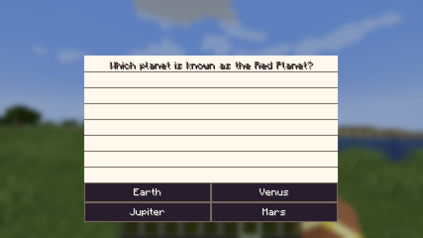

# AnkiCraft

AnkiCraft is a NeoForge Minecraft mod that lets you study while you play. Currently, the mod opens a flashcard screen to the player that has a question and a couple of answers to choose from. Correct answers reward the player with varying levels of loot tables.

## Features

- Multiple-choice flashcards with one correct answer
- Custom deck files loaded from the game directory
- Configurable question interval
- Streak and total-correct tracking
- Reward tables that scale with progress milestones
- Custom flashcard UI styled around an index-card look

## Status

AnkiCraft is still in active development. Build from source for now, and back up worlds or deck files before testing new versions. Deck formats and reward behavior may change while the mod is being worked on.

## Setup

1. Build the mod from source.
2. Put the generated `.jar` file into your Minecraft `mods` folder.
3. Launch the game once, then close it.
4. Open the new `decks` folder in your game directory.
5. Add your `.deck` files to that folder.
6. Launch the game again and play.

## Decks

Deck files use the `.deck` extension and are loaded from the `decks` folder in your Minecraft game directory. Each flashcard currently needs one question, four answers, and a correct answer that matches one of those choices.

## Roadmap

- Fill-in-the-blank questions
- Matching questions
- Rearranging questions, such as sentence building
- Short-answer questions that make use of LLMs to review the answer
- Better reward delivery that does not clutter player inventories
- Image, audio, LaTeX, and video support
- In-game deck builder
- Deck versioning and format migration
- Anki deck import support
- LLM-assisted deck generation
- Math question generation from formulas and random variables
- More UI layout options for longer questions and answers
